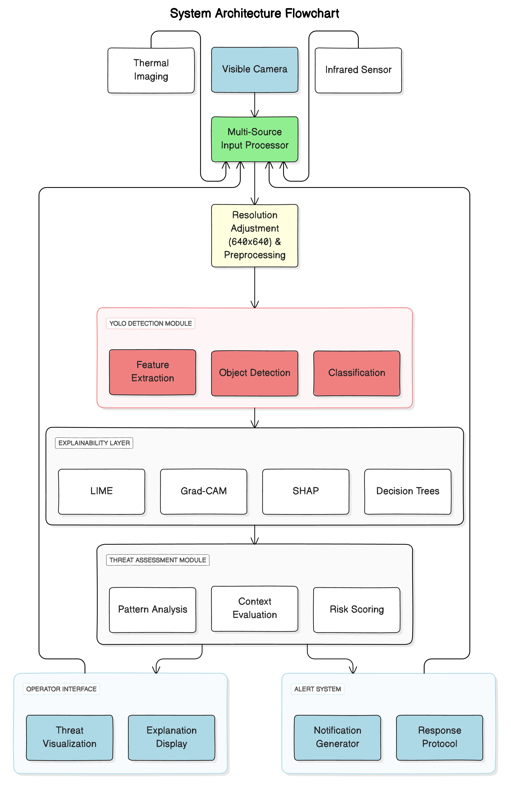
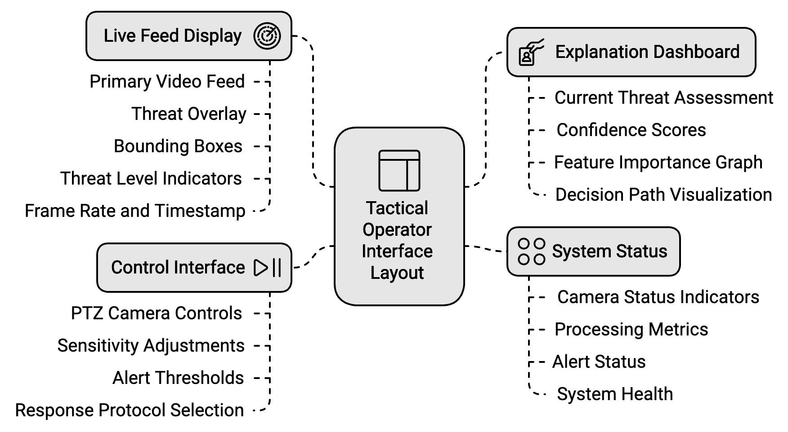
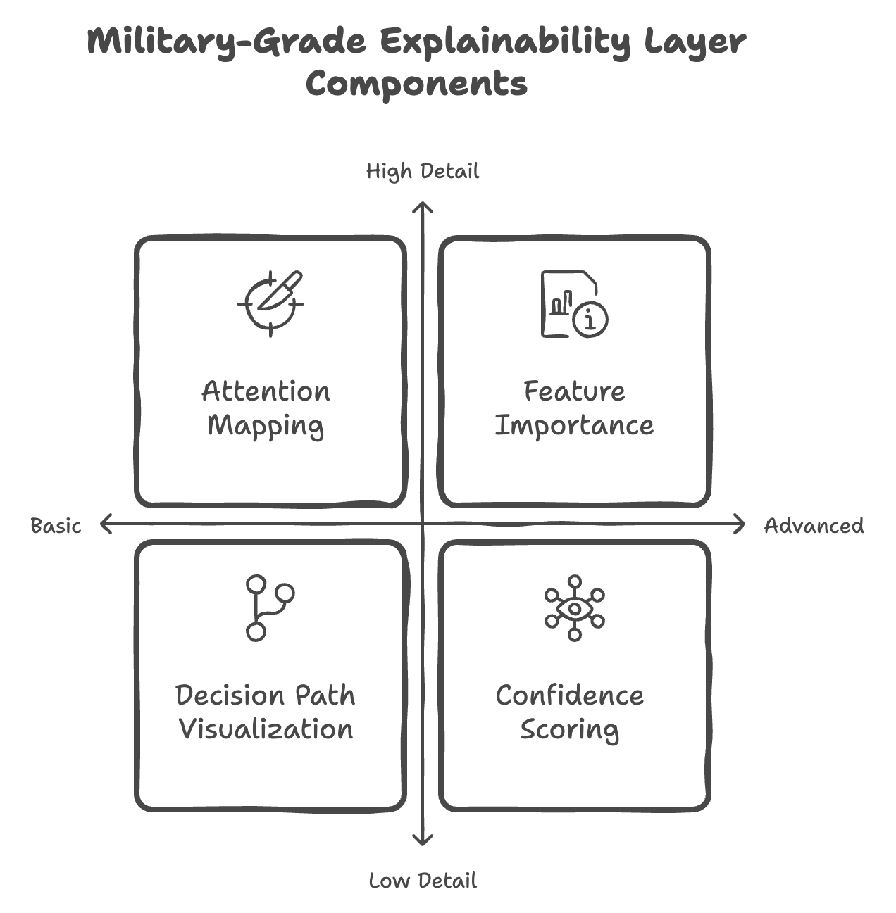
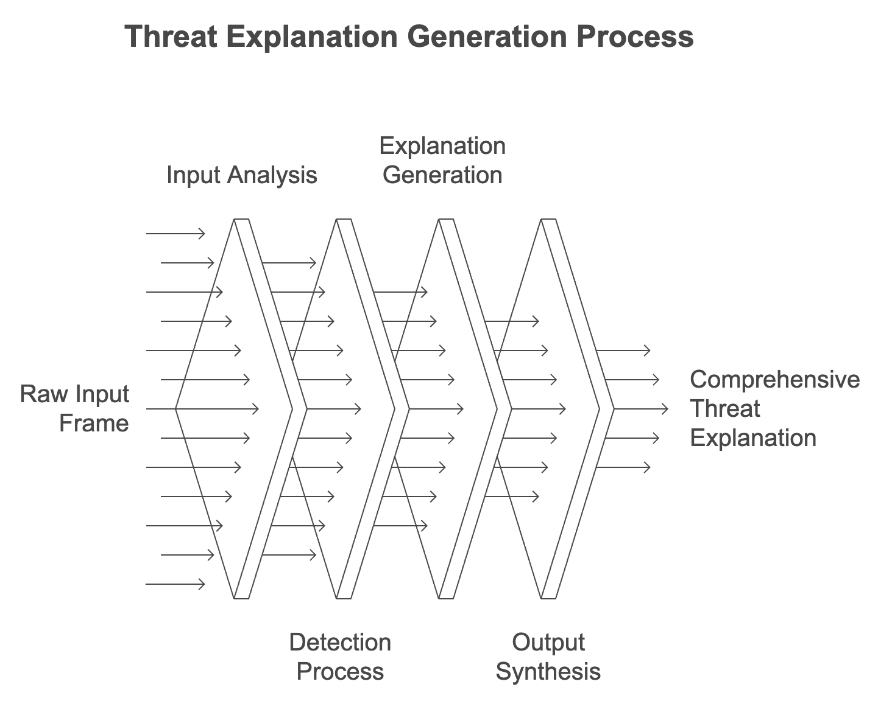

# United States Patent Application Publication
### Publication No.: US 20XX/XXXXXXX A1
### Publication Date: N/A

---

# EXPLAINABLE AI-ENHANCED SECURITY SURVEILLANCE SYSTEM USING YOLO OBJECT DETECTION

---

## CROSS-REFERENCE TO RELATED APPLICATIONS
[0001] Not Applicable

---

## STATEMENT REGARDING FEDERALLY SPONSORED RESEARCH OR DEVELOPMENT
[0002] Not Applicable

---

## FIELD OF THE INVENTION
[0003] The present invention relates to artificial intelligence-based security and surveillance systems, and more particularly to military and high-security applications utilizing YOLO (You Only Look Once) object detection with interpretable outputs for enhanced threat detection and response.

---

## BACKGROUND OF THE INVENTION
[0004] Traditional security surveillance systems in military and high-security environments often lack transparency in their threat assessment processes, potentially leading to delayed responses or misclassification of threats. While recent advances in AI-powered surveillance systems have improved detection accuracy, their "black box" nature limits operator understanding and system accountability in critical security situations.

[0005] Current YOLO-based detection systems excel at real-time object detection but typically do not provide explanations for their decisions. This limitation can be critical in military and security applications where false positives or negatives could have severe strategic consequences.

---

## SUMMARY OF THE INVENTION
[0006] The present invention provides an explainable AI-enhanced surveillance system that combines YOLO object detection with interpretable AI techniques to provide transparent, accountable security monitoring specifically designed for military and high-security environments.

---

## BRIEF DESCRIPTION OF THE DRAWINGS
[0007] FIG. 1 is a system architecture diagram illustrating the main components of the explainable AI-enhanced surveillance system.

[0008] FIG. 2 is a schematic diagram showing the military-grade explainability layer components.

[0009] FIG. 3 is a diagram illustrating the tactical operator interface layout.

[0010] FIG. 4 is a flowchart showing the threat decision explanation flow.

---

## DETAILED DESCRIPTION OF THE INVENTION
[0011] The detailed description set forth below in connection with the appended drawings is intended as a description of various embodiments of the present invention and is not intended to represent the only embodiments in which the invention may be practiced.

### System Architecture
[0012] The system comprises:
- A YOLO-based threat detection module
- An explainability layer
- A tactical operator interface
- A threat assessment and classification module
- An alert and response system

### Operational Steps
[0013] The system operates through the following steps:

#### Surveillance Input Processing
[0014] The system processes surveillance input through:
- Multi-source video feed capture (visible, infrared, thermal)
- Frame preprocessing and normalization
- Resolution adjustment to 640x640 pixels
- Environmental condition compensation

#### YOLO Detection
[0015] The YOLO detection module performs:
- Implementation of YOLO model (versions 8-11 supported)
- Real-time threat object detection with bounding boxes
- Weapon and explosive device classification
- Personnel movement tracking

#### Explainability Layer
[0016] The explainability layer provides:
- Real-time attention mapping for threat areas
- Feature importance visualization for detected objects
- Decision path tracking for threat classification
- Confidence score explanation with military-grade reliability metrics
- Tactical situation awareness indicators

#### Threat Assessment
[0017] The threat assessment module performs:
- Multi-factor threat evaluation based on military protocols
- Pattern analysis of hostile activities
- Context-aware tactical decision support
- Reliability scoring with false-positive mitigation

### Explainability Techniques
[0018] The explainability component utilizes:
- LIME (Local Interpretable Model-agnostic Explanations) for object classification
- Grad-CAM for tactical attention mapping
- SHAP (SHapley Additive exPlanations) values for feature importance
- Decision tree approximation for YOLO decisions with military context
- Real-time explanation generation for rapid response situations

---

## CLAIMS
What is claimed is:

1. A method for explainable AI-enhanced security surveillance, comprising:
   - receiving multi-source surveillance input;
   - processing frames through a YOLO object detection model;
   - generating tactical explanatory outputs through an interpretability layer;
   - providing visual and textual explanations for detected threats; and
   - maintaining a tactical decision audit trail.

2. The method of claim 1, wherein the interpretability layer comprises:
   - multi-spectrum attention mapping;
   - threat feature importance calculation;
   - tactical decision path visualization; and
   - military-grade confidence score interpretation.

3. A system for implementing the method of claim 1, comprising:
   - multi-spectrum surveillance devices;
   - a processing unit running YOLO models;
   - a military-grade explainability module;
   - a tactical operator interface; and
   - an alert and response system.

4. The system of claim 3, wherein the explainability module generates:
   - tactical heat maps of threat regions;
   - weapon and explosive feature contribution scores;
   - standardized tactical explanations; and
   - military reliability metrics.

5. The method of claim 1, further comprising:
   - maintaining a database of tactical explanation patterns;
   - generating operator-friendly interpretations;
   - providing real-time explanation of threat decisions; and
   - supporting tactical feedback integration.

---

## ABSTRACT
An explainable AI-enhanced security surveillance system combines YOLO object detection with interpretable AI techniques to provide transparent, accountable threat monitoring in military and high-security environments. The system includes multi-spectrum video preprocessing, YOLO-based detection optimized for weapon and threat identification, an explainability layer generating tactical attention maps and feature importance visualizations, and an operator interface displaying interpretable results. The invention improves upon existing AI surveillance systems by providing clear explanations for its decisions, enhancing operator trust and system accountability while maintaining high detection accuracy and real-time performance in critical security situations.

## DRAWINGS

Fig. 1: System Architecture Diagram

 

Fig. 2: Military-Grade Explainability Layer Components

 

Fig. 3: Tactical Operator Interface Layout

 

Fig. 4: Threat Decision Explanation Flow

 